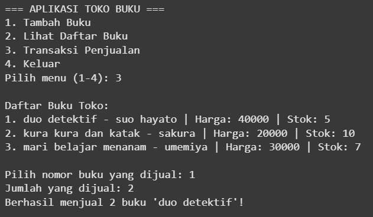

# Aplikasi Toko Buku (CLI)
Aplikasi ini merupakan sistem sederhana berbasis CLI (Command Line Interface) yang digunakan untuk mengelola data penjualan dan stok buku di sebuah toko. Data tersimpan dalam format JSON agar mudah diakses dan disimpan secara lokal.
## Fitur
- Menambahkan buku baru ke toko
- Melihat daftar semua buku yang tersedia
- Melakukan transaksi penjualan buku (mengurangi stok)
- Menyimpan dan membaca data dari file JSON
## Struktur File
toko-buku/ 

├── toko_buku.jpynb ← Program utama (CLI) 

├── user_manual_aplikasi_toko_buku_cli ← panduan program untuk orang awam menggunakan aplikasi ini

├── data_buku.json  ← Data semua buku

├── transaksi.json  ← Riwayat transaksi penjualan

├── README.md       ← Dokumentasi ini 

└── assets/         ← Folder opsional untuk screenshot

## Cara Menjalankan Program
1. jalankan file 'toko_buku.jpynb' menggunakan phython
2. gunakan menu yang tersedia dengan memilih angka 1-4
3. data yang sudah dimasukkan bisa disimpan ke file 'data_buku.json' atau jika melakukan transaksi akan dimasukkan ke 'transaksi.json'
## Data Tersimpan

data_buku.json akan menyimpan informasi buku (judul, penulis, harga, stok)

transaksi.json akan menyimpan catatan penjualan (judul, jumlah, total)

## Screenshot/preview CLI
Masukkan screenshot hasil program CLI kamu ke folder assets/, lalu lampirkan di bawah ini:

## catatan tambahan
- file 'toko_buku.jpynb' berisi logika program CLI. data yang di input pengguna akan disimpan sementara di memori, lalu dapat disimpan permanen ke dalam file 'data_buku.json'
- program ini berjalan di lingkungan terminal/CLI seperti cmd, terminal linux, atau google colab (dengan input manual)
- file 'data_siswa.json' akan terupdate setiap kali menu simpan digunakan
- setiap transaksi penjualan buku terjadi, akan tersimpan di file 'transaksi.json'

## pembuat

nama: fio lola karmila

nim: 24110310027

kelas: 2a

tugas: algoritma dan dasar pemrograman
